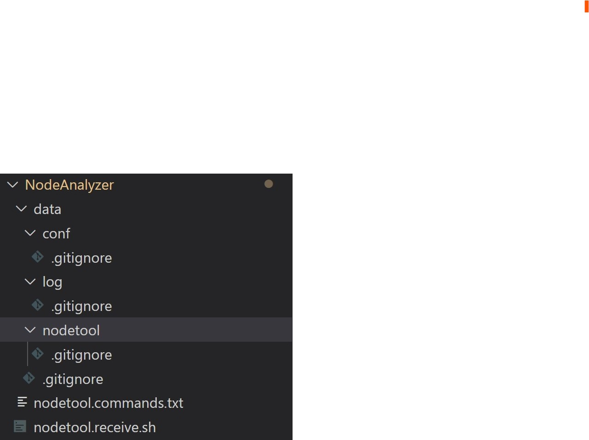

# cassandra.toolkit/NodeAnalyzer
A quick and dirty tool to grab all the information for a specific node and tarzip it into a ball. 

TODO: Later will be integrated better with how TableAnalyzer goes and gets all the data for a cluster. 

Please make sure you move the empty data/* directories if you move this script out. It uses a relative directory reference. 




Example:

Verbose output 

```
./nodetool.receive.sh /var/log/cassandra /etc/cassandra DC1 1
```

Silent output 

```
./nodetool.receive.sh /var/log/cassandra /etc/cassandra DC1 0
```

It uses `hostname -i` to get the IP address to name the tar.gz file

If you want, you can add other nodetool commands to nodetool.commands.txt

http://cassandra.apache.org/doc/latest/tools/nodetool/nodetool.html
