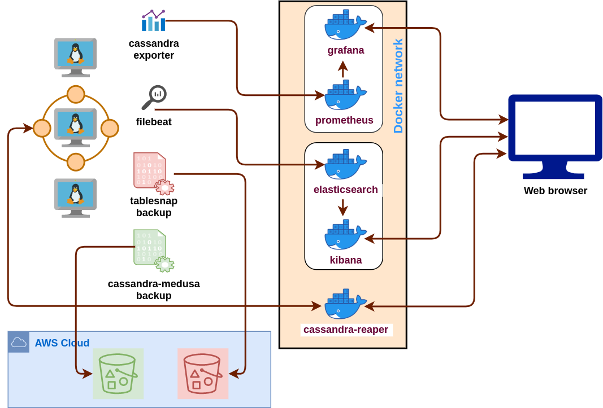

# cassandra.toolkit

A curated set of useful Cassandra compatible tools for building, managing, and monitoring Cassandra clusters.

### Table of Contents:
- [Overview](#overview)
- [Getting Started](#getting-started)
- [Tools in the Toolkit](#tools-in-the-toolkit)
- [Compatibility](#compatibility)
- [Development and Testing](#development-and-testing)
- [Credits](#credits)

# Overview

Cassandra.toolkit makes it easy to setup all the tools you will need for building, managing, and monitoring your Cassandra cluster. 

 
For further information on how all of these tools work together and how to get started, see below.
 
 

# Getting Started

## Cluster Setup
The first step is to get everything installed. [Click here to get started](./docs/setup/README.md). 

These instructions will help you build your Cassandra cluster if you don't have one already, and then to setup Cassandra.toolkit on your cluster. 

Cassandra.toolkit provides good defaults and instructions on how to leverage all of these technologies to set up your cluster with all the Cassandra tools you will need for your cluster. Besides running updates or setting up the toolkit on new Cassandra nodes, you should only have to setup cassandra.toolkit once on your cluster. After that, you can focus on cluster maintenance.

[Click here to setup Cassandra.toolkit on your cluster](./docs/setup/README.md). 

## Cluster Maintenance
After setting up your cluster, you will need to maintain it. All the tools below should already be installed at this point if you followed the instructions for [Cluster Setup](#cluster-setup). However, your Cassandra Cluster is not really a "set it and forget it" kind of database - setting up is just the beginning! The difference is that now that you have cassandra.toolkit setup on your cluster, you have all the tools that you will need already installed and configured. Moreover, this guide will walk you through the process of maintaining your cluster using these battle tested tools.

We break down cluster maintenance into the following categories: 
- [Backups](./docs/cluster-maintenance/backup/README.md)
- [Monitoring](./docs/cluster-maintenance/monitor/README.md)
- [Repairs](./docs/cluster-maintenance/repair/README.md) 

[Click here](docs/cluster-maintenance/README.md) to learn how to use cassandra.toolkit tools to maintain your cluster.

# Tools in the Toolkit
Curious about what tools we will be installing on your cluster? See below for our list of tools that are included in Cassandra.toolkit. 

We provide instructions for how to [setup](./setup/README.md) and [operate](./docs/cluster-maintenance/README.md) these tools into your cluster, but it is helpful to become familiar with each tool on its own as well. Accordingly we provide links to the official project websites for each tool for you to browse.

### Cluster Monitoring

Offline Log Collection and Ingestion
|  |   |
| ------------- | ------------- | 
| [TableAnalyzer](https://github.com/Anant/cassandra.vision/tree/master/cassandra-analyzer/offline-log-collector/TableAnalyzer) | A python based cfstat data anlyzer with a future in being able to visualize other Cassandra / Distributed platform stats. |
| [NodeAnalyzer](https://github.com/Anant/cassandra.vision/tree/master/cassandra-analyzer/offline-log-collector/NodeAnalyzer) | Shell based tool to collect conf, logs, nodetool output as a tar.gz file |

Live (Online) Cluster Monitoring
|  |   |
| ------------- | ------------- | 
| [Metrics Collector for Apache Cassandra (MCAC)](https://github.com/datastax/metric-collector-for-apache-cassandra) | Metric collection and Dashboards for Apache Cassandra clusters | 
| [node_exporter](https://github.com/prometheus/node_exporter) | Prometheus exporter for hardware and OS metrics exposed by *NIX kernels, written in Go with pluggable metric collectors. |
| [cassandra_exporter](https://github.com/criteo/cassandra_exporter) | Cassandra exporter is a standalone application which exports Apache Cassandra® metrics throught a Prometheus friendly endpoint. |
| [Prometheus](https://prometheus.io/) | Prometheus is an open-source systems monitoring and alerting toolkit |
| [Grafana](https://grafana.com/) | Grafana is a multi-platform open source analytics and interactive visualization software. | 
| [Filebeat](https://www.elastic.co/guide/en/beats/filebeat/current/filebeat-overview.html) | Filebeat is a lightweight shipper for forwarding and centralizing log data. Installed as an agent on your servers, Filebeat monitors the log files or locations that you specify, collects log events, and forwards them either to Elasticsearch or Logstash for indexing. Filebeat can also be used for offline log ingestion if you have a log tarball, which is what we do in [cassandra.vision](./docs/cluster-maintenance/monitor/README.md#Cassandra.Vision-Offline-Monitoring) |
| [Elasticsearch](https://www.elastic.co/guide/en/elasticsearch/reference/current/elasticsearch-intro.html) | Elasticsearch is the distributed search and analytics engine at the heart of the Elastic Stack. We use Elasticsearch for monitoring and visualizing Cassandra log files in conjunction with Filebeat and Kibana |
| [Kibana](https://www.elastic.co/guide/en/kibana/7.6/introduction.html) | Kibana provides a GUI for interacting with the Elastic Stack. We use Kibana in particular for visualizing Cassandra log files across the cluster. | 

### Cluster Backups
|  |   |
| ------------- | ------------- | 
| [cassandra-medusa](https://github.com/thelastpickle/cassandra-medusa) | Medusa is an Apache Cassandra backup system. |
| [tablesnap](https://github.com/JeremyGrosser/tablesnap) | Tablesnap is a script that uses inotify to monitor a directory for IN_MOVED_TO events and reacts to them by spawning a new thread to upload that file to Amazon S3, along with a JSON-formatted list of what other files were in the directory at the time of the copy. |
 

### Cluster Repair
|  |   |
| ------------- | ------------- | 
| [Cassandra Reaper](http://cassandra-reaper.io/) | Cassandra Reaper is an open source tool that aims to schedule and orchestrate repairs of Apache Cassandra clusters. | 
 

# Compatibility
## Platform Compatibility
### Target Compatibility
Eventually our goal is to have compatibility for the following platforms:

| Platform            | TableAnalyzer Receive | TableAnalyzer Transform |
| ------------------- | ------------------ | --------- |
| DSE 4.8.x           | Diagnostic Tarball | Y         |
| DSE 4.8.x/C\* 2.1.x | Nodetool           | Y         |
| DSE 4.8.x/C\* 2.1.x | SSH                | Y         |
| DSE 5.1.x           | Diagnostic Tarball | Y         |
| DSE 5.1.x/C\* 3.1.x | Nodetool           | Y         |
| DSE 5.1.x/C\* 3.1.x | SSH                | Y         |
| DSE 6.7.x           | Diagnostic Tarball | Y         |
| DSE 6.7.x/C\* 4.0.x | Nodetool           | Y         |
| DSE 6.7.x/C\* 4.0.x | SSH                | Y         |
| Scylla?             | Tarball            | Y         |
| Elassandra?         | Tarball            | Y         |
| YugaByte?           | Tarball            | Y         |
| CosmosDB?           | Tarball            | Y         |
| AWS MCS?            | Tarball            | Y         |

In the chart above, `TableAnalyzer Receive` refers to the method that we would use to receive TableAnalyzer information for the [TableAnalyzer](https://github.com/Anant/cassandra.vision/tree/master/cassandra-analyzer/offline-log-collector/TableAnalyzer) tool. `TableAnalyzer Transform` refers to whether or not we are able to take the archive file that we received from `TableAnalyzer Receive` and tranform it into a csv file. 

In summary, our goal is that eventually we will be able to install and run all the tools in cassandra.toolkit on the platforms listed above, including to run TableAnalyzer on them to generate a CSV file from the `TableAnalyzer Transform` command, regardless of the method ran in `TableAnalyzer Receive`. 

### Current Compatibilty
[Click here](./src/ansible/README.md#compatibility) for the latest information on platform and ansible version compatibility.

# Development and Testing
See instructions in our [CONTRIBUTING](./docs/CONTRIBUTING.md) file for instructions on getting a development environment set up, as well as contribution guidelines and notes on how this project is organized.

# Credits

1. Rahul Singh - Concept, Curator, Creator of [tableanalyzer](src/TableAnalyzer)
2. Sean Bogaard - Concept, Advisor, Curator
3. John Doe (*) - Developing terraform & ansible automation, testing, documentation of 3rd party tools
4. Obi Anomnachi - Testing