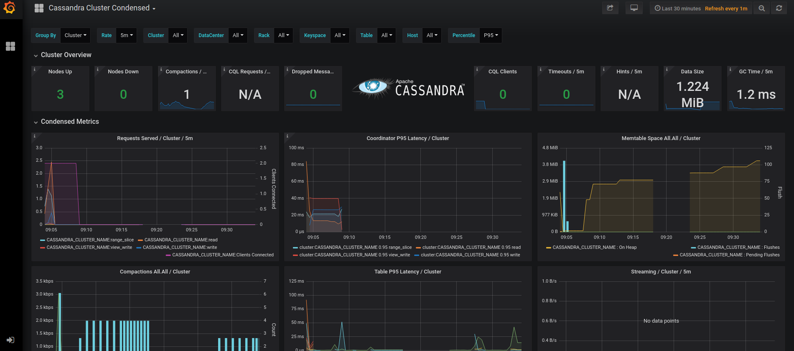

# Setting Up Monitoring - Overview
This document is to provide further instructions for installation of monitoring tools for your Cassandra cluster. [Click here](./setup.ansible-config-files.md#Step-14-set-config-variables-for-your-deployment-in-group_varsallyml) to go back to instructions for filling out your `group_vars/all.yml` file.

This document explains the two ways to do live metrics monitoring in Cassandra.toolkit: 
1) [Prometheus and cassandra_exporter](#monitoring-metrics-with-prometheus-and-cassandra-exporter)
2) [Datastax MCAC](#monitoring-metrics-with-datastax-metric-collector)

For offline monitoring, no setup is required. Instead see documentation regarding [Cassandra.toolkit operation](../operation/monitor/maintenance.offline-monitoring.md). 

## Monitoring Metrics with Prometheus and Cassandra Exporter
One way to do live monitoring with a dashboard is to use cassandra_exporter with Prometheus and Grafana.

Note that as of May 2021, Cassandra Exporter is still in Beta.

The `cassandra_exporter.service` exposes metrics that are compatible with Prometheus server.
Metrics are available on port `8080` when it runs as a `systemd` service in standalone mode, or on port `9500` when it's configured as a JVM agent in `cassandra-env.sh` file. 

Check if cassandra exporter run as as `systemd` service. If it runs successfully, then the `prometheus` docker container is already ingesting metrics and no changes are needed.

```
$ sudo systemctl status cassandra_exporter
```

```
● cassandra_exporter.service - Cassandra Exporter
   Loaded: loaded (/etc/systemd/system/cassandra_exporter.service; enabled; vendor preset: disabled)
   Active: active (running) since Sun 2020-02-16 13:08:33 EST; 51s ago
 Main PID: 1184 (java)
   CGroup: /system.slice/cassandra_exporter.service
           └─1184 /bin/java -jar /opt/cassandra/ddac/lib/cassandra_exporter-2.3.2-all.jar /opt/cassandra/ddac/conf/config.yml
```

### Resources / Further Reading

- https://github.com/criteo/cassandra_exporter
- https://github.com/instaclustr/cassandra-exporter

## Monitoring Metrics with Datastax Metric Collector
A better alternative to the above cassandra_exporter/Prometheus/Grafana installation is [Metrics Collector for Apache Cassandra (MCAC)](https://github.com/datastax/metric-collector-for-apache-cassandra).

Metric Collector for Apache Cassandra (MCAC) aggregates OS and C* metrics along with diagnostic events to facilitate problem resolution and remediation. It supports existing Apache Cassandra clusters and is a self contained drop in agent. Note that internally it is built on top of Prometheus and Grafana, but that Prometheus and Grafana are bundled into MCAC, so that it you won't need to install Prometheus and Grafana separately if you use MCAC.

- https://github.com/datastax/metric-collector-for-apache-cassandra/releases/download/v0.1.10/datastax-mcac-dashboards-0.1.10.zip
- https://github.com/datastax/metric-collector-for-apache-cassandra/releases/download/v0.1.10/datastax-mcac-agent-0.1.10.zip

```
ansible-playbook -i ../../config/ansible/envs/testing/hosts.ini ../../src/ansible/playbooks/cassandra-tools-install.yml -e install_datastax_mcac=True
```

Restart cassandra service on all nodes:
```
ansible-playbook -i ../../config/ansible/envs/testing/hosts.ini ../../src/ansible/playbooks/cassandra-restart-service.yml
```

Launch prometheus and grafana docker containers:
```
docker-compose -f ./artifacts/datastax-mcac/datastax-mcac-dashboards-0.1.10/docker-compose.yaml up
```

You should now be able to view the metrics you are collecting in Grafana and Prometheus in your browser.  
- `http://localhost:3000/` - grafana (admin:admin)
- `http://localhost:9090/` - prometheus 



You are now ready to monitor your cluster. [Click here to learn more](../operation/monitor/README.md).


#### DSE Metrics Collector Dashboards

TODO